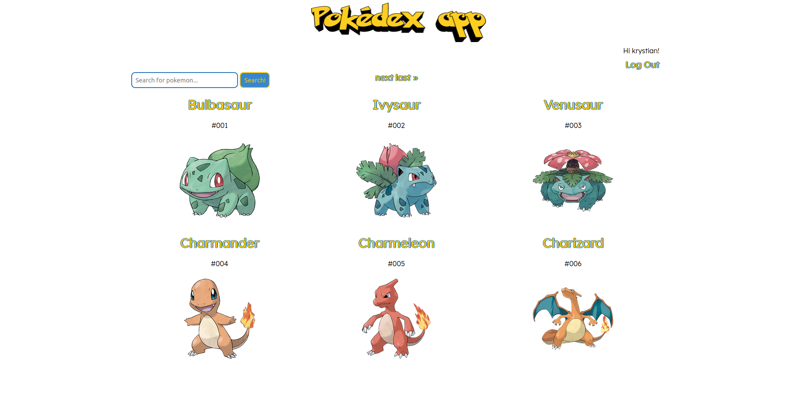
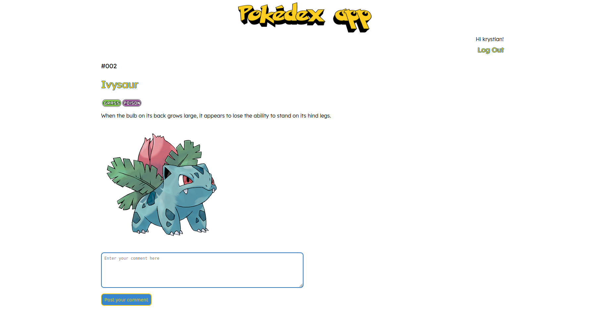

<h1>Pokédex app</h1>

Pokédex application to browse through pokémons.

<h2>Main functions and details</h2>
  <ul>
    <li>Search</li>
    <li>Comment system</li>
    <li>User authorization and authentication</li>
    <li>Data and images parsed from <a href="https://pokeapi.co/">PokéApi</a></li>
    <li>Functional and unit tests</li>
  </ul> 
<h2>Built with</h2>
<h3>Technologies</h3>
  <ul>
    <li>Python</li>
    <li>Django</li>
    <li>HTML</li>
    <li>SCSS</li>
  </ul> 
<h3>Technologies</h3>
  <ul>
    <li>Visual Studio Code</li>
    <li>Linux Terminal</li>
    <li>Git and Github</li>
    <li>Selenium</li>
  </ul> 
<h3>Third party code</h3>
  <ul>
    <li><a href="https://fonts.google.com/">Google Fonts</a></li>
    <li><a href="https://pokeapi.co/">PokéApi</a></li>
    <li><a href="https://django-crispy-forms.readthedocs.io/en/latest/">Crispy forms</a></li>
    <li><a href="https://pypi.org/project/django-test-without-migrations/">Django test without migrations</a></li>
  </ul> 
<h2>Home page</h2>
</img>
<h2>Detail page</h2>
</img>
<h2>Author</h2>

<a href="https://github.com/Vienio99">Vienio99</a>

